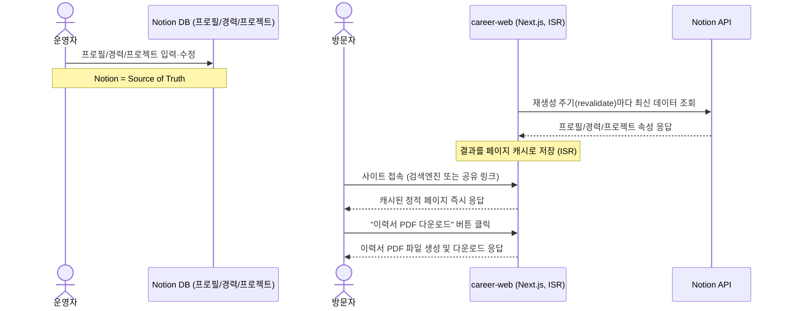
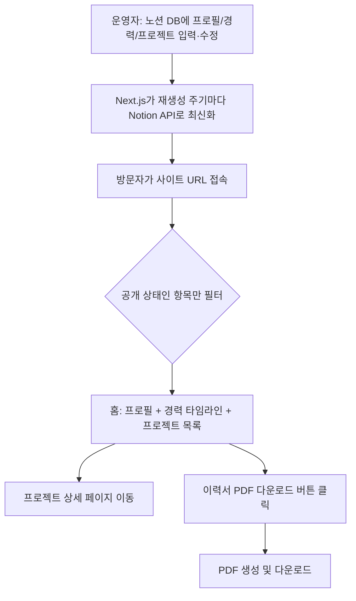

# PRD: 노션 기반 포트폴리오 · 경력관리 웹사이트 (MVP)

- 작성일: 2026-07-27
- 작성자: (시니어 PM 겸 풀스택 아키텍트 역할)
- 대상 저장소: `career-web` (Next.js 15 + React 19)
- 상태: 초안 (개발 착수 전 리뷰 필요)

---

## 개요 (Overview)

본인(운영자)이 노션(Notion) 데이터베이스에 입력한 경력·프로젝트·자기소개 정보를, 누구나 로그인 없이 접속 가능한 공개 웹사이트에서 확인하고, 요약된 이력서를 PDF로 다운로드할 수 있게 하는 개인 포트폴리오 서비스이다. 노션을 콘텐츠 관리 시스템(CMS)의 Source of Truth로 유지하면서, Next.js 서버가 Notion API를 통해 데이터를 가져와 정적/증분 재생성(ISR) 방식으로 렌더링하고, 방문자는 이 웹페이지에서 경력·프로젝트를 탐색하거나 이력서(CV) PDF를 바로 받을 수 있다.

---

## 문제 정의 및 목표

**현재 문제**
- 경력·프로젝트 이력이 노션 페이지 안에만 존재해, 채용 담당자나 협업 대상에게 공유하려면 노션 링크를 그대로 보내야 하고, 이 경우 노션 UI(사이드바, 다른 개인 워크스페이스 항목 등)가 함께 노출되어 전문성이 떨어져 보일 수 있다.
- 이력서를 요청받을 때마다 별도 문서(Word/PDF)를 수동으로 갱신해야 해서, 노션에 최신 정보를 입력해도 실제 배포되는 이력서와 내용이 어긋나기 쉽다.
- 검색엔진에 노출되는 개인 포트폴리오 페이지가 없어 SEO 관점에서 발견되기 어렵다.

**이 기능으로 해결하려는 것**
- 노션에 경력/프로젝트를 입력·수정하는 것만으로 공개 포트폴리오 웹사이트 내용이 자동으로 최신화되게 한다.
- 방문자는 로그인 없이 URL 하나로 프로필, 경력, 프로젝트를 탐색하고, 원하면 이력서를 PDF로 즉시 받을 수 있다.
- 검색엔진에 정상적으로 노출되는(SEO 최적화된) 개인 브랜딩 페이지를 확보한다.

**성공 지표 (KPI)**
1. 홈 페이지 최초 콘텐츠 로딩(LCP) 2.5초 이내 (Core Web Vitals "Good" 기준).
2. 이력서 PDF 다운로드 성공률 98% 이상 (에러 없이 파일 생성 완료 기준).
3. 노션에 경력/프로젝트를 입력한 시점부터 사이트에 반영되기까지 지연이 재생성 주기(예: 1시간) 이내.

---

## 사용자 및 시나리오

### 페르소나 1: 운영자 (본인, Notion 편집자)
- 포트폴리오의 주인. 노션 사용에 익숙하지만 개발 지식은 없어도 콘텐츠를 관리할 수 있어야 함.

**유저 스토리**
- As a 운영자, I want 노션 DB에 경력·프로젝트를 입력/수정하면 별도 배포 작업 없이 사이트에 자동 반영되기를, So that 이력서 파일을 매번 새로 만들지 않아도 된다.
- As a 운영자, I want 아직 공개하고 싶지 않은 프로젝트(작업 중)는 방문자에게 노출되지 않기를, So that 미완성 내용이 실수로 공개되지 않는다.
- As a 운영자, I want 사이트에서 바로 최신 이력서 PDF를 받을 수 있는 링크를 채용 담당자에게 보낼 수 있기를, So that 별도 파일을 첨부하지 않아도 된다.

### 페르소나 2: 방문자 (채용 담당자, 협업 대상 등 외부 사용자)
- 검색엔진이나 공유받은 링크를 통해 접속하는 외부인. 로그인 없이 빠르게 정보를 확인하길 원함.

**유저 스토리**
- As a 방문자, I want 로그인 없이 URL만으로 프로필·경력·프로젝트를 바로 볼 수 있기를, So that 진입 장벽 없이 빠르게 파악할 수 있다.
- As a 방문자, I want 모바일에서도 내용이 깨지지 않고 잘 보이기를, So that 이동 중에도 확인할 수 있다.
- As a 방문자, I want 이력서를 PDF로 다운로드할 수 있기를, So that 채용 프로세스에 파일로 첨부·보관할 수 있다.

---

## 핵심 유저 플로우





---

## 기능 요구사항 (Functional Requirements)

| ID | 요구사항 | 우선순위 | 비고 |
|---|---|---|---|
| FR-1 | 노션에 "프로필", "경력", "프로젝트" 데이터베이스 스키마를 정의하고, 각 필드를 애플리케이션 타입으로 매핑하는 규칙을 문서화·구현한다 | P0 | 7번 "데이터 모델" 참고 |
| FR-2 | 서버(Server Component)에서 Notion API(`@notionhq/client`)로 프로필/경력/프로젝트 목록을 조회한다 | P0 | 아래 "조회 방식" 상세 참고 |
| FR-3 | 홈 페이지(`/`)에서 프로필(이름, 한줄소개, 사진, 연락처), 경력 타임라인, 프로젝트 목록(썸네일 카드)을 렌더링한다 | P0 | 8번 "화면 설계" 참고 |
| FR-4 | 프로젝트 상세 페이지(`/projects/[id]`)에서 프로젝트 설명, 역할, 사용 기술, 기간, 외부 링크(GitHub/데모)를 렌더링한다 | P0 | |
| FR-5 | 방문자가 "이력서 PDF 다운로드" 버튼 클릭 시 프로필+경력 요약을 이력서 형식 PDF로 다운로드할 수 있다 | P0 | 아래 "PDF 생성 및 다운로드" 참고 |
| FR-6 | 노션에서 공개 상태가 아닌(초안) 프로젝트/경력 항목은 사이트에 노출되지 않는다 | P0 | 노션 DB의 `공개여부`(Status) 필드로 필터링 |
| FR-7 | 노션 필드가 예상과 다른 타입이거나 값이 비어있을 경우, 애플리케이션이 죽지 않고 방어적으로 처리(기본값/빈 문자열 등)한다 | P0 | 노션 스키마는 언제든 바뀔 수 있음을 전제 |
| FR-8 | 전 페이지는 모바일/태블릿/데스크톱에서 반응형으로 정상 표시된다 | P0 | Tailwind 반응형 유틸 사용 |
| FR-9 | 사이트는 재생성 주기(ISR `revalidate`)로 데이터를 갱신하며, Notion API를 방문 요청마다 직접 호출하지 않는다 | P0 | 공개 사이트 특성상 트래픽 예측이 어려우므로 요청 단위 호출을 피함 |
| FR-10 | 각 페이지에 OG 메타태그(제목/설명/썸네일), `sitemap.xml`, `robots.txt`를 제공해 검색엔진·SNS 공유에 대응한다 | P0 | SEO가 핵심 목표 중 하나 |
| FR-11 | Notion API 429(rate limit) 응답 시 재생성 작업이 실패하지 않도록 재시도 로직을 둔다 | P1 | 요청 단위 호출이 아니므로 우선순위는 견적서 케이스보다 낮음 |
| FR-12 | 프로젝트는 노션에서 지정한 순서(정렬 필드) 또는 최신순으로 목록에 표시된다 | P1 | "확인 필요 사항" 참고 |
| FR-13 | 페이지 방문 통계(간단한 조회수 등)를 수집한다 | P2 | Out of Scope 참고 |
| FR-14 | 다국어(영문 이력서/포트폴리오) 지원 | P2 | Out of Scope 참고 |
| FR-15 | 운영자용 관리 웹 UI(노션을 거치지 않고 웹에서 직접 편집) | P2 | Out of Scope 참고 |

### 조회 방식 (상세)

- 프로필/경력/프로젝트 모두 `databases.query`로 조회하며, 경력·프로젝트는 `filter: { property: "공개여부", status: { equals: "공개" } }` 조건을 항상 포함한다.
- 캐싱은 Supabase 같은 별도 DB 없이 **Next.js의 `fetch` 캐시 + `revalidate`(ISR)** 로 처리하는 것을 기본으로 한다. 개인 포트폴리오는 트래픽 패턴이 예측 가능하고 실시간성이 중요하지 않으므로, 견적서 MVP에서 사용한 Supabase 캐시 테이블 같은 별도 인프라는 이 시점에서 과설계다. 트래픽이 커지거나 실시간 반영이 필요해지면 그때 Supabase 캐싱을 P2로 검토한다.
- 재생성 주기(`revalidate`)는 기본 1시간으로 설정하고, 운영자가 "지금 바로 반영"이 필요하면 Next.js `revalidatePath`를 호출하는 관리자 전용 엔드포인트(FR와 별개, P1)를 열어둘 수 있다.

---

## 비기능 요구사항 (Non-Functional Requirements)

**성능**
- 모든 공개 페이지는 정적 생성(SSG) 또는 ISR로 제공하여 방문 시점에 Notion API를 직접 호출하지 않는다 (목표: LCP 2.5초 이내).

**보안**
- Notion API 키(`NOTION_API_KEY`)는 서버 사이드(빌드/재생성 시점)에서만 사용하며, 클라이언트 번들에 절대 포함되지 않도록 `NEXT_PUBLIC_` 접두사를 붙이지 않는다.
- 공개 사이트이므로 접근 제어(토큰/링크 추측 방지)는 필요 없지만, 초안 상태 콘텐츠는 조회 API/빌드 단계에서부터 항상 제외한다 (FR-6).
- 이메일 등 연락처는 스팸 봇 크롤링을 줄이기 위해 `mailto:` 링크를 클라이언트 사이드에서 조합하는 등 최소한의 난독화를 고려한다.

**반응형**
- Tailwind CSS 브레이크포인트(`sm`, `md`, `lg`) 기준으로 모바일에서는 프로젝트 그리드를 1열, 경력 타임라인을 세로형으로 전환한다.

**에러 핸들링 원칙**
- 모든 서버 로직(Notion API 호출, PDF 생성)은 try/catch로 감싸고, 실패 시 사용자에게는 일반화된 메시지를, 서버 로그에는 상세 원인을 남긴다.
- 노션 응답의 필드 누락/타입 불일치는 예외가 아닌 방어적 파싱(옵셔널 체이닝 + 기본값)으로 처리한다.

**API 응답 형식 일관성**
- 프로젝트 공통 타입인 `ApiResponse<T>`(`src/types/index.ts`)를 모든 내부 API 라우트에서 그대로 사용한다.

**SEO**
- 각 페이지에 `generateMetadata`로 동적 title/description/OG 이미지를 설정하고, `sitemap.ts`/`robots.ts`(Next.js App Router 컨벤션)를 구현한다.

---

## 데이터 모델

### 노션 DB 필드 스키마 — "프로필" 데이터베이스 (1행만 사용)

| 필드명(노션) | 내부 키 | Notion 속성 타입 | 필수 | 설명 |
|---|---|---|---|---|
| 이름 | `title` | `title` | Y | 프로필 페이지 제목 겸 이름 |
| 직함/한줄소개 | `headline` | `rich_text` | Y | 예: "프론트엔드 개발자" |
| 자기소개 | `bio` | `rich_text` | N | 상세 소개 문단 |
| 프로필 사진 | `avatar` | `files` | N | |
| 이메일 | `email` | `email` | N | |
| GitHub | `github` | `url` | N | |
| LinkedIn | `linkedin` | `url` | N | |
| 블로그 | `blog` | `url` | N | |

### 노션 DB 필드 스키마 — "경력" 데이터베이스

| 필드명(노션) | 내부 키 | Notion 속성 타입 | 필수 | 설명 |
|---|---|---|---|---|
| 회사명 | `title` | `title` | Y | |
| 직무 | `role` | `rich_text` | Y | |
| 시작일 | `startDate` | `date` | Y | |
| 종료일 | `endDate` | `date` | N | 비어있으면 "재직중"으로 처리 |
| 주요 업무/성과 | `description` | `rich_text` | N | |
| 사용 기술 | `skills` | `multi_select` | N | |
| 공개여부 | `status` | `status` | Y | `draft` / `published` |

### 노션 DB 필드 스키마 — "프로젝트" 데이터베이스

| 필드명(노션) | 내부 키 | Notion 속성 타입 | 필수 | 설명 |
|---|---|---|---|---|
| 프로젝트명 | `title` | `title` | Y | |
| 한줄 소개 | `summary` | `rich_text` | Y | 목록 카드에 노출 |
| 상세 설명 | `description` | `rich_text` | N | 상세 페이지 본문 |
| 기간 | `period` | `date` | N | `date.start` ~ `date.end` |
| 역할 | `role` | `rich_text` | N | |
| 사용 기술 | `skills` | `multi_select` | N | |
| 대표 이미지 | `thumbnail` | `files` | N | |
| GitHub/데모 링크 | `link` | `url` | N | |
| 공개여부 | `status` | `status` | Y | `draft` / `published` |
| 정렬 순서 | `order` | `number` | N | 값이 없으면 기간 최신순 정렬로 폴백 |

### 노션 필드 ↔ 내부 타입 매핑 (TypeScript)

```typescript
// src/types/portfolio.ts

export type PublishStatus = "draft" | "published";

export interface Profile {
  name: string;
  headline: string;
  bio: string | null;
  avatarUrl: string | null;
  email: string | null;
  github: string | null;
  linkedin: string | null;
  blog: string | null;
}

export interface Career {
  id: string;
  company: string;
  role: string;
  startDate: string; // ISO date string
  endDate: string | null; // null이면 재직중
  description: string | null;
  skills: string[];
}

export interface Project {
  id: string;
  title: string;
  summary: string;
  description: string | null;
  periodStart: string | null;
  periodEnd: string | null;
  role: string | null;
  skills: string[];
  thumbnailUrl: string | null;
  link: string | null;
  order: number | null;
}
```

```typescript
// src/lib/notion/mappers.ts
import type { PageObjectResponse } from "@notionhq/client/build/src/api-endpoints";
import type { Career, PublishStatus } from "@/types/portfolio";

function extractPlainText(richText: { plain_text: string }[] | undefined): string {
  if (!richText || richText.length === 0) return "";
  return richText.map((block) => block.plain_text).join("");
}

function parseStatus(value: string | undefined): PublishStatus {
  return value === "published" ? "published" : "draft";
}

export function mapNotionPageToCareer(page: PageObjectResponse): Career {
  const props = page.properties;

  const companyProp = props["회사명"];
  const company = companyProp?.type === "title" ? extractPlainText(companyProp.title) : "";

  const roleProp = props["직무"];
  const role = roleProp?.type === "rich_text" ? extractPlainText(roleProp.rich_text) : "";

  const startDateProp = props["시작일"];
  const startDate = startDateProp?.type === "date" ? startDateProp.date?.start ?? "" : "";

  const endDateProp = props["종료일"];
  const endDate = endDateProp?.type === "date" ? endDateProp.date?.start ?? null : null;

  const skillsProp = props["사용 기술"];
  const skills =
    skillsProp?.type === "multi_select"
      ? skillsProp.multi_select.map((option) => option.name)
      : [];

  return {
    id: page.id,
    company,
    role,
    startDate,
    endDate,
    description: null, // 필요 시 위와 동일한 패턴으로 파싱
    skills,
  };
}
```

---

## 화면 설계

**`/` 홈 페이지 와이어프레임 (텍스트 설명)**

1. **히어로/프로필 영역**
   - 프로필 사진, 이름, 한줄소개(`headline`), 연락처 아이콘 버튼(이메일/GitHub/LinkedIn/블로그).
2. **자기소개 영역**
   - `bio` 텍스트 블록.
3. **경력 타임라인 영역**
   - 회사명/직무/기간을 세로 타임라인 카드(`Card`)로 나열, 최신순 정렬.
4. **프로젝트 목록 영역**
   - 반응형 그리드(데스크톱 3열 → 모바일 1열)로 프로젝트 카드(썸네일, 제목, 한줄소개, 사용 기술 `Badge`) 표시.
5. **하단 액션 영역**
   - "이력서 PDF 다운로드" `Button`(primary), 클릭 시 로딩 스피너 표시 후 파일 다운로드.

**`/projects/[id]` 프로젝트 상세 페이지**

- 대표 이미지, 제목, 기간, 역할, 사용 기술(`Badge` 목록), 상세 설명, 외부 링크(GitHub/데모) 버튼.
- 존재하지 않거나 비공개 프로젝트 접근 시 404 페이지.

**재사용 가능한 shadcn/ui 컴포넌트**: `card`, `badge`, `button`, `avatar`, `separator`, `skeleton`(로딩 상태), `tooltip`.

---

## API 설계

모든 응답은 `src/types/index.ts`의 `ApiResponse<T>` 형식(`{ success, data, error }`)을 따른다.

| Method | Path | 설명 | 요청 | 응답 |
|---|---|---|---|---|
| GET | `/api/resume/pdf` | 프로필+경력 요약을 이력서 PDF로 생성해 다운로드 | - | `application/pdf` 바이너리 스트림 (실패 시 `ApiResponse<never>` JSON) |
| POST | `/api/revalidate` | (내부/운영자용, P1) 노션 변경사항을 즉시 재생성 트리거 | Body: `{ secret: string; path: string }` | `ApiResponse<{ revalidated: true }>` |

- 프로필/경력/프로젝트 목록 조회는 별도 공개 API를 두지 않고, Server Component에서 직접 Notion 조회 함수를 호출해 서버 렌더링한다 (공개 사이트이므로 클라이언트가 별도로 이 데이터를 fetch할 필요가 없음).

**에러 코드 예시**

| code | 상황 | HTTP status |
|---|---|---|
| `PROJECT_NOT_FOUND` | 존재하지 않거나 비공개 프로젝트 접근 | 404 |
| `NOTION_API_ERROR` | Notion API 호출 실패(재시도 소진 후) | 502 |
| `PDF_GENERATION_FAILED` | PDF 생성 중 오류 | 500 |

---

## PDF 생성 및 다운로드 (라이브러리 비교)

| 라이브러리 | 장점 | 단점 | 서버리스 적합성 |
|---|---|---|---|
| `@react-pdf/renderer` | React 컴포넌트 문법으로 이력서 레이아웃 작성, 별도 브라우저 바이너리 불필요 | 복잡한 CSS 레이아웃은 PDF 전용 컴포넌트로 별도 작성 필요, 한글 폰트 별도 임베드 필요 | 우수 — 서버리스 함수에서 안정적으로 동작 |
| `puppeteer` + HTML | 웹에서 보이는 레이아웃을 그대로 PDF로 변환 | Chromium 바이너리 필요, 서버리스 배포 크기/콜드스타트 문제 | 낮음 |
| `jspdf` (+ `html2canvas`) | 클라이언트 사이드에서 즉시 실행 가능 | 이미지 캡처 방식이라 텍스트 선택 불가, 한글/고해상도 품질 저하 | 결과물 품질이 이력서 용도에 부적합 |

**추천: `@react-pdf/renderer`** — 서버리스 배포 적합성과 텍스트 기반 PDF 품질(선택/검색 가능한 텍스트) 때문에 견적서 MVP와 동일하게 추천한다. `/api/resume/pdf` 라우트에서 프로필+경력 데이터를 이력서 템플릿 컴포넌트에 주입해 `renderToStream`으로 응답한다. **한글 폰트(Noto Sans KR 등)를 반드시 별도 등록**해야 한다(견적서 PRD와 동일한 이슈).

---

## Out of Scope (MVP 제외 범위)

- 로그인/인증 (완전 공개 사이트이므로 애초에 불필요).
- 방문자 문의 폼 백엔드 연동 — `mailto:` 링크로 대체, 폼 제출·이메일 발송 인프라는 제외.
- 관리자 웹 편집 UI (모든 콘텐츠 수정은 노션에서만 발생).
- 방문 통계/분석 대시보드 (필요 시 외부 분석 도구 스크립트 삽입 정도만 P2로 고려).
- 다국어(영문 등) 포트폴리오/이력서.
- 블로그, 댓글 기능.
- 프로젝트별 개별 PDF 소개서 (이력서 PDF 하나로 통합).

---

## 리스크 및 오픈 이슈

- **노션 스키마 변경 시 깨짐 가능성**: 속성 이름/타입이 바뀌면 매핑 함수가 실패할 수 있음 → 방어적 파싱(FR-7)으로 완화, 빌드/재생성 실패 시 알림(Slack 등, 이 저장소에 이미 Slack 훅 존재) 검토.
- **PDF 렌더링 시 한글 폰트 깨짐**: `@react-pdf/renderer`는 한글 폰트를 기본 지원하지 않으므로 Noto Sans KR 폰트 파일을 반드시 포함하고 라이선스를 확인해야 함.
- **ISR 반영 지연**: 재생성 주기 동안은 노션 수정이 즉시 반영되지 않음 → 운영자가 급히 반영해야 할 경우를 대비해 수동 재생성 트리거(P1) 필요.
- **이미지 최적화**: 노션에 업로드된 이미지 URL은 일정 시간 후 만료될 수 있어(Notion 파일 URL 특성), 재생성 시점마다 새 URL로 갱신되는지 확인 필요. 장기적으로는 자체 스토리지에 미러링하는 방안도 검토 가능(P2).

---

## 마일스톤 (초안)

1. **1단계 — Notion 연동 및 데이터 조회**: 프로필/경력/프로젝트 DB 스키마 확정, `@notionhq/client` 설정, 조회·매핑 함수 구현.
2. **2단계 — 홈/프로젝트 상세 UI**: shadcn/ui 기반 레이아웃, 반응형 대응.
3. **3단계 — SEO**: 메타태그, sitemap, robots.txt, OG 이미지.
4. **4단계 — 이력서 PDF**: `@react-pdf/renderer` 템플릿 구현, 한글 폰트 임베드.
5. **5단계 — QA 및 마감**: 다양한 노션 데이터 케이스 테스트, Lighthouse 성능/SEO 점검.

---

## 사전 준비 사항 (Notion 연동 체크리스트)

Notion API 연동을 시작하려면 아래 항목이 필요하며, 운영자(사용자)가 직접 확인·준비해야 한다.

1. **Notion Integration 생성**: [notion.so/my-integrations](https://www.notion.so/my-integrations)에서 새 Internal Integration을 만들고 **API 시크릿 키(Internal Integration Token)** 를 발급받는다.
2. **데이터베이스에 Integration 연결**: 프로필/경력/프로젝트 각 데이터베이스 페이지에서 우측 상단 `···` → `연결 추가(Add connections)` 로 위에서 만든 Integration을 반드시 추가해야 API로 조회가 가능하다 (누락 시 "찾을 수 없음" 오류 발생).
3. **데이터베이스 ID 확인**: 각 DB를 브라우저에서 열었을 때 URL에 포함된 32자리 영숫자 값이 데이터베이스 ID다 (3개 DB 각각 필요).
4. **필드(속성) 스키마를 위 "데이터 모델" 표와 맞추기**: 필드명은 한글 그대로 사용 가능하나, 타입(제목/텍스트/날짜/멀티셀렉/상태 등)은 표에 명시된 타입과 일치해야 매핑 함수가 정상 동작한다.
5. **환경변수 전달**: 발급받은 API 키와 3개 DB ID를 `.env.local`에 등록할 수 있도록 전달 (`NOTION_API_KEY`, `NOTION_PROFILE_DB_ID`, `NOTION_CAREER_DB_ID`, `NOTION_PROJECTS_DB_ID`).

---

## 확인 필요 사항

- 프로필을 별도 데이터베이스로 관리할지, 아니면 단일 노션 페이지(DB가 아닌 일반 페이지)로 관리할지 — 표는 DB(1행) 기준으로 작성했으나 페이지 방식이 더 간단할 수도 있음.
- 프로젝트 정렬 방식: 노션에 `정렬 순서` 필드를 수동으로 관리할지, 항상 기간 최신순으로 자동 정렬할지.
- 재생성 주기(ISR `revalidate`) 값 — 초안 1시간이 실제 업데이트 빈도에 적합한지.
- 이력서 PDF 템플릿의 구체적 디자인/포함 항목(예: 프로젝트 요약 포함 여부, 자격증/교육 이력 추가 여부).
- 커스텀 도메인 사용 여부 및 배포 환경(Vercel 등).
- 방문자 문의 수단을 `mailto:` 링크만으로 충분히 여기는지, 혹은 별도 폼이 필요한지.
